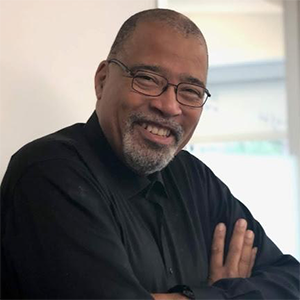
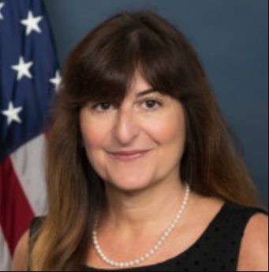
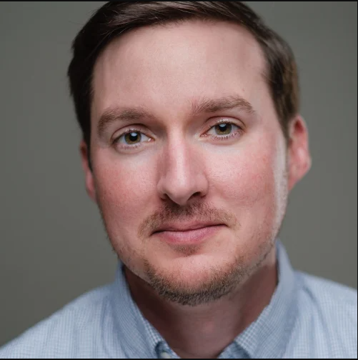

 

---
title: "DJNF: Data-Driven Investigative Reporting"
author: "Philip Merrill College of Journalism"
date: "Sunday, June 2 - Saturday, June 8, 2024"
output: html_document
---

# Itinerary

**Pre-Conference**

-   **By May 29**: Students will have data assignments described.
-   **By May 29**: Students will be sent a data starter kit to load relevant software on their laptops and test out their equipment.
-   **Due Thursday May 30, 11:59 p.m.**: Students assigned to profile each other.

**Sunday, June 2, 2024**

-   **2 p.m.**: Welcome at Knight Hall Eaton Theater. Wells, Denny, Hughes and Shirley Carswell, DJNF Executive Director
    -   Logistics. The week ahead. Rooms meals.
    -   Profiles introductions by students.
-   **3:30 p.m.**: Use data to find stories. Finding Data for Projects (Wells). Eaton Theater
-   **4:30 p.m.**: Break and then independent work
    -   Students gather data for their assigned communities. Produce draft story ideas by 11:59 p.m.
-   **5:30 p.m.**: Break
-   **6:30 p.m.**: Dinner in Hyattsville - Busboys & Poets. (Meet at Knight Hall board van)

**Monday, June 3, 2024**

-   **Breakfast**: On your own at dorm
-   **9 a.m.**: Meet at Knight Hall Room 1101
    -   Data Driven Reporting. (Sean Mussenden, the Howard Center)
        -   Bring material into R and make sense of it.
        -   Basic webscraping, PDF data extraction
-   **10:30 a.m.**: Break. Coffee served
-   **11 a.m.**: Workshop: Use data to find stories. (Wells, Mussenden). Room 1101
-   **12:30 p.m.**: Lunch in Knight Hall.
    -   Speaker: Gary Fields, AP Democracy Reporter. Eaton Theater
-   **1:30 p.m.**: Writing a story pitch memo. (Wells and Denny). Room 1101
-   **2:30 p.m.**: Students gather data for their assigned communities. Produce a story pitch memo by 11:59 p.m. (Wells, Mussenden, TA coach). Room 1101
-   **4 p.m.**: Diversity: Covering All of the Community. (Prof. Christoph Mergerson). Room 1101
-   **5:30 p.m.**: Break
-   **6:30 p.m.**: Dinner on campus

**Tuesday June 4, 2024**

-   **Breakfast**: On your own at dorm
-   **9 a.m.**: Data Visualization. Using Datawrapper for data visualization. (Adam Marton). Room 1101
-   **10:30 a.m.**: Break. Coffee served.
    -   Heather Taylor, manager of digital media and programs, Dow Jones News Fund.
-   **11 a.m.**: Workshop. Students work on R data gathering story pitches. (Wells, Marton, TA as coaches). Room 1101
-   **12 p.m. - 1 p.m.**: Lunch. Sandwiches served in Knight Hall.
-   **1 p.m. - 2:30 p.m.**: Jeannine Aversa, U.S. Census Bureau or Bureau of Economic Analysis, localizing stories with BEA data. Eaton Theater
-   **2:30 p.m. - 4 p.m.**: Multimedia. (Josh Davidsburg) multimedia for the web, best practices for shooting photos and video with cell phones. Room 1101
-   **4 p.m.**: Break. Drinks.
-   **4:30 p.m.**: Multimedia / data workshop. (Wells, Davidsburg, TA coach). Room 1101
-   **5:30 p.m.**: Break
-   **6:30 p.m.**: Dinner in Hyattsville - Franklins. (Meet at Knight Hall board van)

**Wednesday June 5, 2024**

-   **Breakfast**: On your own at dorm
-   **9 a.m.**: Hosting and Capturing Data (Derek Willis). GitHub pages, getting your data on the web, web scraping, API walkthrough.
-   **10:30 a.m.**: Break. Coffee served.
-   **11 a.m.**: Workshop. Open workshop on projects. (Wells, Willis as coaches). Room 1101
-   **12:30 p.m.**: Lunch in Knight Hall. Workshop. (Wells, Willis, TA coach). Room 1101
-   **1:30 p.m.**: Speaker: Connie Mitchell Ford on business reporting. Room 1101
    -   Three ways to get business and economic data and how to localize it.
-   **3 p.m.**: Break
-   **3:30 p.m.**: Workshop. Connie Mitchell Ford workshop on project proposals. (Wells, TA as coaches). Room 1101
-   **5 p.m.**: Break
-   **6:30 p.m.**: Dinner on campus
-   **11:59 p.m.**: Second draft of reporting memos due

**Thursday June 6, 2024**

-   **Breakfast**: On your own at dorm
-   **8:30 a.m.**: Meet at Knight Hall, board van, depart for College Park Metro
-   **10:00 a.m.**: Tour U.S. Capitol press galleries with Siobhan Hughes, WSJ.
-   **Noon**: Lunch in the U.S. Capitol. Meeting with other journalists.
-   **2 p.m.**: Tour of Associated Press D.C. bureau. Chad Day, chief elections analyst
-   **3:30 p.m.**: Open to explore D.C. or join Wells for an adventure
-   **6 p.m.**: Dinner in Washington D.C.: Ben’s Chili Bowl

**Friday June 7, 2024**

-   **Breakfast**: On your own at dorm
-   **9 a.m.**: Using AI in journalism, algorithmic accountability. (Prof. Daniel Trielli)
    -   Conceptual discussion of AI and possibilities
-   **10:00 a.m. - 10:30 a.m.**: Break
-   **10:30 a.m.**: Workshop on projects. (Wells, Trielli, TA coach)
-   **12:30 p.m.**: Lunch in Knight Hall.
    -   Speaker: Prof. Kevin Blackistone on racial justice in sports business
-   **2 p.m.**: Workshop on projects (Wells, TA coach)
-   **3:30 p.m.**: Meet at Knight Hall, board van, depart for College Park Metro, dinner in Washington D.C., attend a community jazz show at [Westminster Church](https://westminsterdc.org/our-pastor). Meet with Rev. Brian Hamilton beforehand to discuss Southwest D.C. history

**Saturday June 8, 2024**

-   **Breakfast**: On your own at dorm
-   **10:00 a.m.**: Students present web pages, story pitches, solicit feedback. Shirley Carswell, DJNF Executive Director, visits
-   **12:30 p.m.**: Lunch in Knight Hall
-   **2 p.m.**: Prof. Karen Denny on skills to survive in the newsroom.
-   **4 p.m.**: Free time / Final work on projects. (Wells, TA coach)
-   **5:30 p.m.**: Dinner in Riverdale, La Fantome Food Hall (Meet at Knight Hall board van)

**Sunday June 9, 2024**

-   Breakfast available at Yahentamitsi Dining Hall.
-   Depart

# Instructors

**Sean Mussenden**

Sean Mussenden, a former Washington correspondent, is the data editor for the Howard Center for Investigative Journalism. He previously oversaw an experiential, hands-on journalism training program at Merrill College that is integral to the college’s “teaching hospital” model of professional instruction: Capital News Service.

He also teaches traditional courses incorporating data visualization, programming, web development, web design, data analysis, social media and computational journalism. Mussenden was appointed to the rank of principal lecturer in 2023.

**Derek Willis**

Derek Willis, one of the nation’s leading data journalists and an experienced educator, joined the Philip Merrill College of Journalism in Fall 2021 as a lecturer in data and computational journalism.

Willis came to Merrill College having spent 25 years winning awards at some of the top news outlets in the country. His latest stop was ProPublica, where he served as a news applications developer since 2015.

He previously held interactive journalism roles with The New York Times and The Washington Post, after working as a database reporter for The Washington Post, The Center for Public Integrity, Congressional Quarterly and The Palm Beach Post.

**Daniel Trielli**

Daniel Trielli joined the Philip Merrill College of Journalism's faculty in Fall 2023 as assistant professor of media and democracy.

He researches the impact of algorithmic curation on journalism and political information, and studies how Google affects the news and the audiences that use it to search. He is interested in data and computational journalism, media literacy and algorithmic accountability. Trielli came to Merrill College as a master's student in 2015 after a 10-year career as a journalist in Brazil at the national newspaper, O Estado de S. Paulo, and the regional newspaper, Diário do Grande ABC.

**Adam Marton**

Adam Marton is an award-winning journalist and graphic designer who joined the Philip Merrill College of Journalism in 2018 after 13 years at The Baltimore Sun.

Marton is focused on quality storytelling across media, using design and technology to tell rich, human stories. He is a visual journalist and designer specializing in the presentation of the news, including data visualization, front-end development and information graphics.

**Rob Wells**

Rob Wells, a 2016 Ph.D. alum of Merrill College, returned to the university in the Spring 2022 semester after more than five years at the University of Arkansas, where he rose to the rank of associate professor and led Arkansas' journalism graduate program. Wells has more than two decades of business journalism experience at The Associated Press, Bloomberg News and The Wall Street Journal.

Wells is the author of “The Enforcers: How Little-Known Trade Reporters Exposed the Keating Five and Advanced Business Journalism” (2019) and "The Insider: How the Kiplinger Newsletter Bridged Washington and Wall Street" (2021).

**Constance Mitchell Ford**

Constance Mitchell Ford, a 1977 University of Maryland graduate, is a financial journalist who spent more than three decades covering economics, banking, investing and real estate.

Most of those years were spent at The Wall Street Journal in New York, most recently as the Global Real Estate and Property Bureau Chief. Under her leadership, reporters in the real estate group won dozens of journalism awards. Ford personally received the Scripps Howard National Journalism Award for business and economics reporting in 2007 for stories about the subprime mortgage crisis.

**Josh Davidsburg**

Josh Davidsburg is an award-winning broadcast journalist, documentary filmmaker who earned his M.A. at Merrill College in 2024 and his B.A. at Merrill in 2001.

Davidsburg started his career at WMDT in Salisbury; three years later, he moved to Fort Myers, Florida, where he worked for NBC-2 WBBH for two years. He then returned home to work for WBAL in Baltimore and Maryland Public Television, where he reported for two years.

He specializes in streaming media and the intersection between cinema and journalism. His passion lies in the future of journalism and the role streaming video and social media will play in the profession. Davidsburg teaches documentary and broadcast journalism as a senior lecturer.

**Karen Denny**

Karen Denny is Merrill College's director of internships and career development. She previously served as the Annapolis bureau director of the Capital News Service, until taking over leadership of the career center at the beginning of 2022. Denny is a former editor with the McClatchy-Tribune (formerly Knight Ridder/Tribune) News Service, where she founded the wire’s Newsfeatures and International sections, and most recently was a features editor.

She previously worked as the Maryland editor for The Washington Times, and at the suburban Journal Newspapers as an editor and local government reporter. She also served as a professor at Sang Ji University in Won Ju, South Korea.

**Christoph Mergerson**

Christoph Mergerson, who completed his Ph.D. in Communication, Information and Media at Rutgers University, joined the Philip Merrill College of Journalism in Fall 2021 as a visiting assistant professor. He was appointed to the rank of assistant professor in Fall 2022.

Mergerson's research and teaching interests include journalism history, weather journalism, race and media, and journalism and democracy. Mergerson arrived at Merrill with ongoing research that examines whether news media in the Southern United States are producing racially inclusive, public-service journalism. He brings award-winning classroom experience from teaching courses at Rutgers, including Communication Law and Global News.

**Kevin Blackistone**

Kevin Blackistone is a longtime national sports columnist now at The Washington Post, a panelist on ESPN’s “Around the Horn,” a contributor to National Public Radio and coauthor of “A Gift for Ron,” a memoir by former NFL star Everson Walls published in November 2009 that details his kidney donation to onetime teammate Ron Springs.

Blackistone was a sports columnist for AOL Fanhouse from October 2007 to March 2011 and an award-winning sports columnist for The Dallas Morning News from September 1990 to September 2006.

Blackistone is a recipient of numerous awards, including awards for sports column writing from the Texas Associated Press Managing Editors, for investigative reporting from the Chicago Newspaper Guild and for enterprise reporting from the National Association of Black Journalists.

**Aidan Hughes**

Aidan Hughes is a Howard Fellow and graduate student at Merrill College with a background in data, politics, and peace and conflict studies. He earned a B.A. in International Studies and Creative Writing from Virginia Tech in 2017, followed by an M.A. in Conflict Transformation and Social Justice from Queen’s University Belfast.

Hughes’ time in post-conflict Northern Ireland, coupled with his professional experience as a data scientist, fuels his interest in harnessing the strengths of both storytelling and data analysis to examine social issues.

# Guest Speakers

**Gary Fields**  

A graduate of Northwestern State University in Natchitoches, Gary Fields is an award-winning journalist with more than 40 years of journalism and communications experience, including 30 years at The Associated Press, The Wall Street Journal and USA TODAY. Fields contributed articles on the events of September 11, 2001, earning the Journal a Pulitzer Prize in 2002 for Breaking News coverage. In 2023 he was named a Louisiana Legend by the Louisiana Public Broadcast. He is a past winner of the National Association of Black Journalists Journalist of the Year Award. He has won a number of other journalism awards, including the Thurgood Marshall Award and the Edgar A. Poe Award for the White House Correspondents.

Gary hails from Alexandria, Louisiana and attended Southern University in Baton Rouge and LSU Alexandria before finishing his final two years at NSU where he holds an undergraduate degree in Broadcast and an MA in English. He has served on the board of the Fund for Investigative Journalism and the Investigative Reporters and Editors Inc. Fields has served on the board of directors of the Lutheran Church of St. Andrew in Maryland and he has been a foster parent in Maryland. He and his wife Helen live in Maryland and have three daughters. He is papa to three grandchildren.

**Jeannine Aversa** 

Jeannine Aversa is chief of communications at the U.S. Bureau of Economic Analysis, one of the world's leading statistical agencies. Before joining BEA in the fall of 2011, Aversa was a journalist for nearly 30 years and reported for The Associated Press, Bloomberg News, Fairchild Publications and other news organizations. For more than a decade, Aversa’s coverage focused on economics, monetary policy, finance and politics. She holds a bachelor’s degree in journalism from the University of Missouri at Columbia.

**Siobhan Hughes** 

Siobhan Hughes is a reporter covering Congress in The Wall Street Journal's Washington bureau. She joined the congressional team after the 2010 elections and has spent more than a decade tracking the growth of partisanship and political fragmentation in the U.S. She has covered government shutdowns, two presidential impeachment trials, several Supreme Court nomination fights, and the enactment of major tax, trade, stimulus and climate laws. Her coverage also explores the intersection of policy, process and personality.

Before joining the Journal's congressional team, she had an energy beat for Dow Jones Newswires. She has also worked at Congressional Quarterly and Bloomberg News. Siobhan began her career covering securities policy for Institutional Investor's newsletter division.

**Chad Day** 

Chad Day is chief elections analyst at The Associated Press. Day is a member of AP’s Decision Desk and writes about politics and elections. Previously, he was a national political reporter for The Wall Street Journal in Washington and an investigative reporter at the Associated Press. He was part of a team at the Journal awarded the 2023 Pulitzer Prize in Investigative Reporting for a series of stories exposing federal conflicts of interest. 

He is an adjunct lecturer at Georgetown University School of Continuing Studies where he teaches data journalism for master's students. He is a former investigative reporter for the Arkansas Democrat-Gazette. He earned a Bachelor's degree in journalism from the University of Missouri at Columbia.

**Rev. Brian Hamilton** 

Hamilton is pastor and preacher at the Westminister Presbyterian Church (USA) in Southwest Washington, D.C. Hamilton serves the community as President of the SW Renaissance Development Corporation that runs Westminster's Jazz and Blues ministry that resulted in the award-winning programs Friday Night Jazz, Blue Monday Blues, Thinking About Jazz, SW Catering and more. He has lived and worked in the community for nearly three decades and is passionate about improving community relations and the social and economic conditions of Southwest residents.

# DJNF Data Interns

**Martha Contreras**

Martha Contreras is a senior at Northwestern University pursuing Journalism and International Studies majors and a Legal Studies minor. Contreras is a National Association of Hispanic Journalists chapter president and is interested in covering immigration, investigative journalism, politics, education, and foreign affairs. She will be interning at the Investigative Project on Race and Equity.

**Shifra Dayak**

Shifra Dayak is a recent graduate of the University of Maryland, havin completed a B.A. in Journalism and B.S. in Environmental Science and Policy. She is most interested in covering politics, the environment, race and identity, labor issues, and business. She will be interning at the Connecticut Mirror, and in September will be joining NOTUS as an Allbritton Journalism Institute fellow.

**Shradha Dinesh**

Shradha Dinesh is a senior at William and Mary, majoring in Data Science and Political Journalism. Dinesh has been recognized as a ProPublica Emerging Reporter (2023-24) and is a Pulitzer Center Reporting Fellow. Dinesh is interested in covering climate, education, and public policy/government meetings and will be interning at the Howard Center at the University of Maryland this Summer

**Cameron Fozi**

Cameron Fozi is a recent graduate of UC Berkeley, having majored in Data Science. Fozi has received multiple awards from the California College Media Association for social justice reporting, graphics reporting, and enterprise reporting. He is interested in Business Reporting, Data Journalism, and Digital Media and will be interning with the Bay City News Foundation this summer.

**Hannah Marszaleck**

Hannah Marszaleck is a recent graduate of the University of Maryland, having majored in Journalism with a minor in History. Marszaleck will be interning with Inside Climate News this summer, and is most interested in Environment, Entertainment, Education, and Public Policy reporting.

**Hannah Rosenberger**

Hannah Rosenberger is a recent graduate of UNC Chapel Hill, graduating with majors in Journalism and English & Comparative Literature, with a minor in Hispanic Studies. She was a senior writer at The Daily Tar Heel for three years and is most interested in education, business or legal reporting. She will be interning at ASI Media/Counselor magazine.

**Rachel Sanchez Smith**

Rachel Sanchez Smith is a senior at the University of Arkansas majoring in Journalism and Political Science. She has won awards for her reporting with KUAF and ArkansasCovid and is most interested in Health Labor, Politics, Human Rights, Immigration, Government, and Investigative/Watchdog reporting. She will be interning with the Arkansas Democrat-Gazette.

**Michael Zhang**

Michael Zhang is a senior at the University of Texas at Austin majoring in Sociology with minors in Computer Science and Journalism. Zhang has previously worked or interned at The Daily Texan, The Daily Dot and KPRC News. Zhang is most interested in investigative reporting, especially relating to policing, and will be interning with Houston Landing.

# Resources

**Campus Map**

